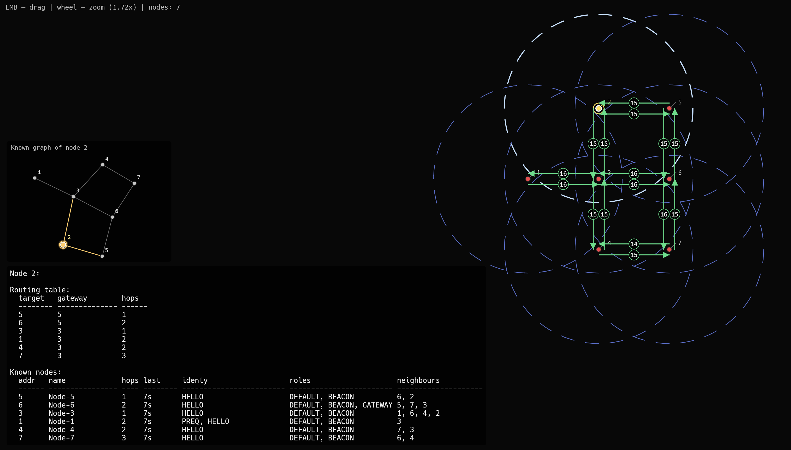

# Burelom
Is an experimental mesh network developed to organize a cluster of low-power sensor devices spread across rough terrain and to operate for a long time in severe environmental conditions without human intervention. It is developed in pure Rust and the Embassy async framework and is intended for use as a bare-metal application on hardware platforms that support this stack (generally STM32, ESP32, and nRF). The network stack architecture is developed as fully decoupled layers at L1–L3 of the OSI model. This means that any layer of the project may be interconnected with different implementations within certain bounds.

This repository contains an implementation of the L3 layer, which implements the mesh network itself. Architecturally, it represents a classical self-repairing mesh with AODV routing. The project is at the earliest stage of development, but some features already work:

- Network connectivity. It can transfer packets from one node to another through several hops, relying on a dynamic routing mechanism.
- AODV is fully implemented. The network can build dynamic routes based on passing PREQ and PREP packets through the mesh.
- Beaconing mechanics and the collection of node-to-node information about the network are supported. Each node at each moment of the network lifetime has its own representation of the network topology. This information may be used for discovery, status detection, and debugging needs.
- Basic valuable payload encryption based on vector cryptographic algorithms.
- Gateway functionality, where a node is used as an interface for communication with some external network.
- Partial testing on the real hardware (in one hop mode).
- Routes consistency. Control of gateway alive and drop routes if there is offline. Reversed RERR packets if route was break on some point.

What I intend to do in the near future:
- Raise the debug logging level
- Remove outdated and unverified routes (partially realized, new RCREQ mechanick)
- Packet-level CMAC
- Defence against packet duplication attacks
- Hardware testing (multyhop testing)

Next steps will be dictated by real-world operational requirements and will be established after the first “in metal” tests.

About how it is developed. Because such networks are incredibly hard to test (at the development stage) on real hardware, I built the emulator environment for this need. The emulator presents a simple logical virtualization of the RF physical layer and allows nodes to work as if they were run on a device with a real MAC-PHY layer under the hood. Practically, for now, the emulator is the only way to see how the network works. The emulator has a UI that allows one to see the network working in real time — sniff packets, see defined routes, known neighbours, and node-reconstructed topology. The functionality of this UI expands as new functionality is invented and new debugging needs arise.

